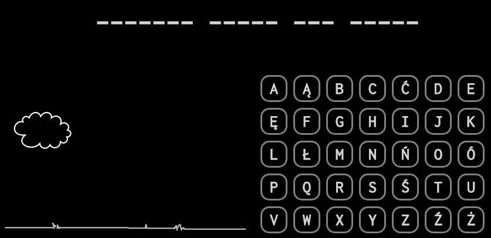
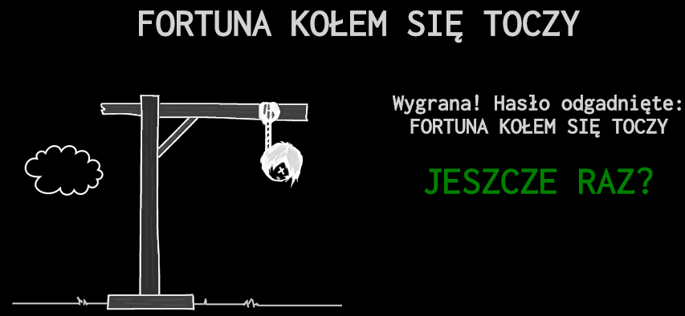

# Game: Hangman
Hangman is a paper and pencil guessing game for two or more players. One player thinks of a word, phrase or sentence and the other(s) tries to guess it by suggesting letters or numbers, within a certain number of guesses.
## Table of Contents
* [General info](#general-info)
* [Screenshots](#screenshots)
* [Technologies](#technologies)
* [Status](#status)
* [Code Examples](#code-examples)
* [Features](#features)
* [Contributing](#contributing)
* [License](#license)
* [Author](#author)
## General Info
The aim of the game is guessing letters in a partially or fully obscured word. The network receives as input a representation of the word (total number of characters, the identity of any revealed letters) as well as a list of which letters have been guessed so far. It returns a guess for the letter that should be picked next. 
## Screenshots


## Technologies
Project is created with:
- HTML5
- CSS3
- JS ES6
## Status
Project is: _done_
## Code Examples

```
function start() {
    var divContent = ""; //place of alphabet

    //loop that will work 35 times
    for (i=0; i<=34; i++) {
        var element = "lett" + i; //creating IDs for particular letters (lett1, lett2, etc)
        divContent = divContent + '<div class="letter" onclick="sprawdz('+i+')" id="'+element+'">'+letters[i]+'</div>'; // div with letters creation
        if ((i+1) % 7==0) divContent = divContent + '<div style="clear:both;"></div>'; // clear:both every 7 letter to start a new row of letters
    }

    document.getElementById("game-alphabet").innerHTML = divContent;
    show_sentence();
}
```

## Features
#### List of features ready and TODOs for future development
* Phrases are uploaded into the game
* If the correct letter is selected it appears in the screen
* If the wrong letter is selected the image changes
* at the end you can select to play one more time by submitting the button

#### To-do list:
_everything has been done_
## Contributing
Contributions to the project library are welcome. Please note the following guidelines before submitting your pull request:
 - Follow [JS coding](https://developer.mozilla.org/bm/docs/Web/JavaScript/Guide) standards
 - Write tests for new functions and added featues
## License
MIT License: Copyright (c) 2018 Martyna Zyskowska
## Author
Martyna Zyskowska
